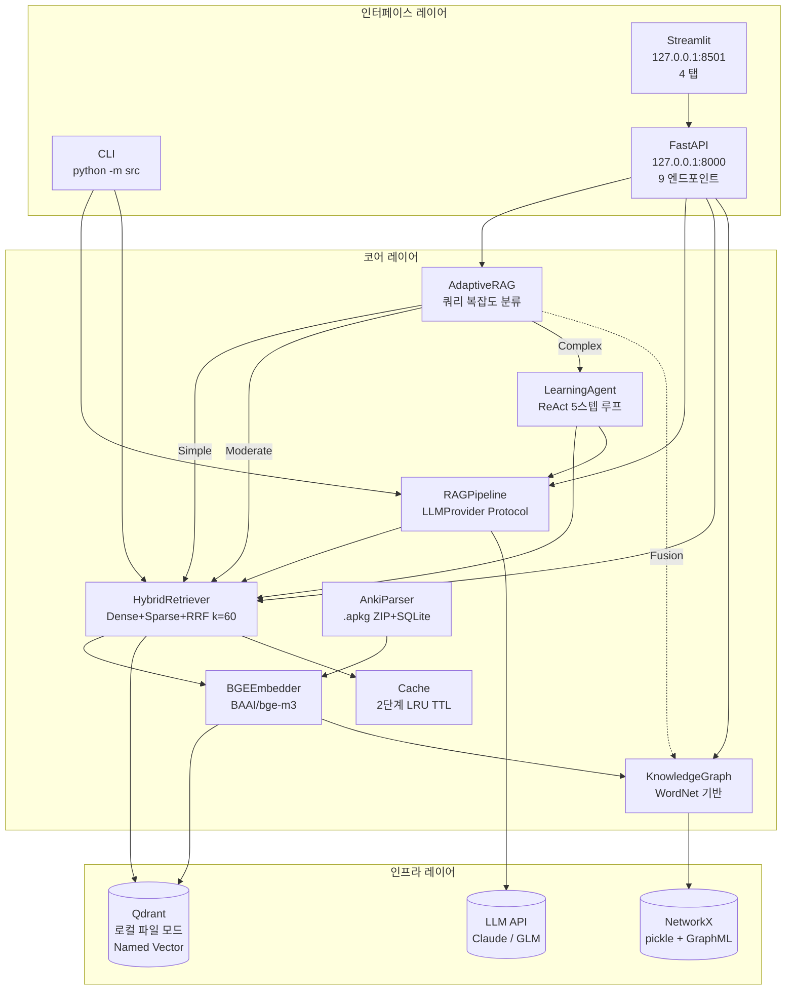
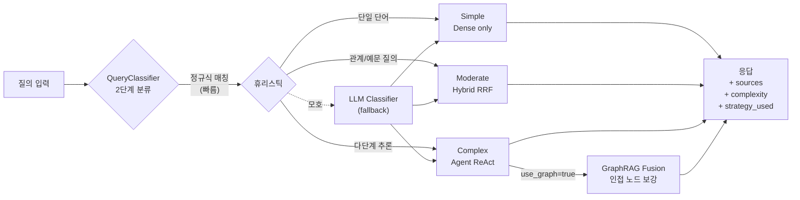

# Anki RAG

영어 학습 특화 RAG (Retrieval-Augmented Generation) 시스템

> Anki 플래시카드(.apkg) 24,472개 → Qdrant 73,410 포인트 인덱싱 → BGE-M3 하이브리드 검색 → Claude/GLM LLM → 단어·예문·발음·출처 응답

## 한눈에 보기

| 항목 | 수치 |
|------|------|
| 인덱싱 포인트 | 73,410 (Qdrant 컬렉션 `anki_rag`) |
| 지식 그래프 | 22,285 노드 / 30,670 엣지 (ANTONYM 7,160 포함) |
| 자동화 테스트 | 167개 (수집 기준) |
| 핵심 모듈 LOC | 2,709 (테스트 별도 2,948) |
| 응답 평균 지연 | Simple ~1.2s / Complex(Agent ReAct) ~6~8s |
| 지원 LLM | Claude (Anthropic) / GLM, OpenRouter (OpenAI 호환) |

## 시스템 아키텍처



## Adaptive RAG 전략 분기



---

## 주요 기능

### v1.x — 하이브리드 RAG (구현 완료)

- **Anki 파싱**: .apkg ZIP + SQLite (anki21/anki2) + HTML 정제 + 오디오 추출
- **BGE-M3 임베딩**: Dense 1024d + Sparse SPLADE 통합 인코딩, fp16 자동 전환
- **RRF Hybrid Search**: Dense + Sparse + RRF Fusion (k=60) + fetch_multiplier=3 + Exact Match 부스팅
- **2단계 캐시**: 검색 캐시 + 파이프라인 캐시 (LRU + TTL)
- **Multi-LLM Provider**: `LLMProvider` Protocol → Claude / OpenAI 호환 (GLM, OpenRouter) 인터페이스 통일
- **Few-shot 프롬프트**: 응답 포맷 고정 + "검색된 자료에 없습니다" hallucination 가드
- **오디오 재생**: .apkg 미디어 추출 + CLI/Web UI 재생

### v2.0 — Agentic + GraphRAG (구현 완료, 기말 추가)

- **LearningAgent (ReAct)**: 5스텝 Thought-Action-Observation 루프, Tool 4종 (search_word, rag_query, get_related_words, filter_by_source)
- **Self-RAG**: `_needs_retrieval()` — 검색 필요 여부 LLM 사전 판단
- **Corrective RAG**: 점수 임계값 미만 시 동의어 재작성 (최대 2회)
- **AdaptiveRAG**: 정규식 휴리스틱 → LLM fallback의 2단계 분류, Simple/Moderate/Complex 전략 분기
- **Knowledge Graph (WordNet)**: SYNONYM·ANTONYM 자동 추출 + DERIVED_FROM 형태소 규칙 + CO_OCCURS 예문 동시 출현
- **그래프 영속화**: pickle + GraphML 이중 저장 (data/graph.pkl, data/graph.graphml)
- **GraphRAG Fusion**: Complex 경로에서 벡터 검색 결과에 그래프 인접 노드 자동 보강
- **Streamlit 그래프 탭**: Plotly 방사형 시각화 + 관계 타입 색상 코드 + 빠른 예시 버튼

---

## 빠른 시작 (3분)

```bash
# 1) 의존성 설치
pip install -e .

# 2) WordNet 코퍼스 (GraphRAG 활성화)
python -m nltk.downloader wordnet omw-1.4

# 3) LLM 키 설정
echo 'ANTHROPIC_API_KEY="sk-ant-..."' >> .env
# 또는
echo 'LLM_API_KEY="..."' >> .env
echo 'LLM_BASE_URL="..."' >> .env
echo 'LLM_MODEL="..."' >> .env

# 4) 인덱싱 (한 번만, ~10분)
python -m src index --data-dir ./data

# 5) 대화형 실행
python -m src chat
```

또는 Web UI:

```bash
# Windows
start.bat

# Linux/Mac
uvicorn src.api.main:app --host 127.0.0.1 --port 8000 &
streamlit run src/web/app.py
```

→ http://127.0.0.1:8501

---

## 데모 응답 샘플

### Simple 쿼리 — Dense only

**입력**: `POST /api/adaptive {"question": "abandon meaning"}`

```json
{
  "complexity": "simple",
  "strategy_used": "dense_only",
  "answer": "abandon [/əˈbændən/]\nv. 단념하다, 버리다, 포기하다\nn. 자유분방, 방종\n예문: abandon our homes...",
  "sources": [
    {"word": "abandon", "source": "--forvo-youglish_link", "deck": "해커스-초록이"},
    {"word": "abandonment", "source": "toefl_voca_v1", "deck": "TOEFL 영단어"}
  ]
}
```

### Complex 쿼리 — Agent ReAct + GraphRAG Fusion

**입력**: `POST /api/adaptive {"question": "비즈니스에서 계약 해지 관련 단어를 난이도 순으로 정리해줘", "use_graph": true}`

```json
{
  "complexity": "complex",
  "strategy_used": "agent_react",
  "graph_used": true,
  "total_agent_steps": 3,
  "agent_steps": [
    {
      "thought": "비즈니스에서 계약 해지 관련 단어들을 검색해보겠습니다.",
      "tool": "search_word",
      "args": {"query": "계약 해지 terminate cancel contract", "top_k": 10},
      "observation": "[점수:0.032] terminate — v. 끝내다... [점수:0.028] nullify — v. 무효화하다..."
    },
    { "thought": "더 많은 계약 해지 관련 단어들을 검색...", "tool": "search_word", "...": "..." }
  ],
  "answer": "## 비즈니스 계약 해지 관련 단어 — 난이도 순\n초급: cancel, end\n중급: terminate, void, breach...",
  "sources": [...]
}
```

### Hallucination 방어 — 존재하지 않는 단어

**입력**: `POST /api/query {"question": "quibblesnark meaning"}`

```
검색된 자료에 없습니다.

"quibblesnark"라는 단어는 제공된 참고 자료에 존재하지 않습니다.

다만, 참고 자료에서 유사한 단어는 찾을 수 있습니다:
quibble [/ˈkwɪbəl/]
뜻: 둔사(핑계)하다, 모호한 말을 하다, 익살부리다; 생트집을 잡다
출처: 편입 영단어 2022 (xfer_voca_2022)
```

---

## REST API (9개 엔드포인트)

| Endpoint | Method | Description |
|----------|--------|-------------|
| `/health` | GET | 헬스체크 |
| `/api/search` | POST | 하이브리드 검색 (exclude_sentences, deduplicate 지원) |
| `/api/query` | POST | RAG 질의응답 |
| `/api/audio/{id}` | GET | 오디오 스트리밍 |
| `/api/index` | POST | 백그라운드 인덱싱 |
| `/api/index/status` | GET | 인덱싱 진행 상태 |
| `/api/adaptive` | POST | 적응형 RAG (Simple/Moderate/Complex 자동 분기, use_graph 옵션) |
| `/api/agent` | POST | ReAct Agent 직접 호출 |
| `/api/cache/stats`, `/api/cache` | GET, DELETE | 캐시 통계/초기화 |
| `/api/graph/related/{word}` | GET | 단어 인접 관계 조회 (relation_type 필터) |
| `/api/graph/stats` | GET | 그래프 통계 (per_relation 분포) |

OpenAPI 문서: `http://127.0.0.1:8000/docs`

---

## CLI 명령어

```bash
# 인덱싱
python -m src index --data-dir ./data

# 단순 검색
python -m src search "abandon" --source toefl --top-k 5
python -m src search "abandon" --deck "TOEFL 영단어" --play-audio

# RAG 질의 (단발)
python -m src query "abandon의 뜻과 예문을 알려줘"
python -m src query "give up 관련 구동사를 알려줘" --stream

# 대화형 모드 (반복 입출력 루프)
python -m src chat --stream
```

---

## 환경변수

```bash
# === LLM (둘 중 하나 필수, ANTHROPIC 우선) ===
ANTHROPIC_API_KEY=sk-ant-...
LLM_MODEL=claude-sonnet-4-6           # 권장

# OpenAI 호환 폴백 (GLM, OpenRouter 등)
LLM_API_KEY=your-api-key
LLM_BASE_URL=https://api.z.ai/api/coding/paas/v4
LLM_MODEL=glm-5

# === Qdrant ===
QDRANT_LOCATION=./qdrant_data         # 로컬 파일 모드 (기본)
# QDRANT_LOCATION=:memory:            # 인메모리 모드 (테스트)
# QDRANT_LOCATION=http://localhost:6333 # 서버 모드
```

---

## 테스트

```bash
# 전체 테스트 (167개)
pytest

# 빠른 회귀 (특정 모듈)
pytest tests/test_graph.py tests/test_adaptive.py tests/test_agent.py -v

# 커버리지
pytest --cov=src --cov-report=html
```

기말 시점 모듈별 커버리지:
- `src/graph.py` — 86%
- `src/adaptive.py` — 96%
- `src/indexer.py` — 90%
- `src/api/routes/graph.py` — 89%

---

## 프로젝트 구조

```
data/
├── *.apkg              # Anki 패키지 5종 (TOEFL/편입/해커스/구동사)
├── 10000.txt           # 원서 1만 문장
├── graph.pkl           # 지식 그래프 (pickle)
├── graph.graphml       # 지식 그래프 (상호운용)
└── media/              # 추출된 오디오

src/
├── models.py           # Pydantic 데이터 모델
├── parser.py           # AnkiParser, TextParser
├── embedder.py         # BGE-M3 임베딩 (Dense + Sparse)
├── indexer.py          # Qdrant 인덱싱 + 그래프 자동 빌드
├── retriever.py        # HybridRetriever (RRF + Exact Match + 중복 제거)
├── audio.py            # 오디오 추출/재생
├── cache.py            # 2단계 LRU+TTL 캐시
├── rag.py              # RAGPipeline + LLMProvider Protocol
├── agent.py            # LearningAgent (ReAct + Self-Correction)
├── adaptive.py         # QueryClassifier + AdaptiveRAG
├── graph.py            # KnowledgeGraph + GraphBuilder
├── __main__.py         # Click CLI
├── api/
│   ├── main.py
│   └── routes/         # search, query, audio, index, cache, agent, adaptive, graph
└── web/
    └── app.py          # Streamlit (검색 / 채팅 / 지식 그래프 / 관리)

doc/
├── 설계서_v2.md        # 중간고사 설계서 (베이스라인)
├── 설계서_final.md     # 기말 최종판 (구현 결과 추가, 12+페이지)
├── 기말_동작검증_보고서.md  # 종단간 검증 결과
└── md_to_hwp.py        # md → docx → hwp 변환 스크립트

.moai/specs/            # SPEC-First 명세 (EARS 형식)
├── SPEC-RAG-001.md     # v1.0 베이스
├── SPEC-RAG-002.md     # v1.2 Agent
├── SPEC-RAG-003.md     # v1.3 Adaptive
├── SPEC-RAG-004.md
└── SPEC-GRAPHRAG-001/  # v2.0 GraphRAG (spec/plan/acceptance)

tests/                  # pytest 167개 (graph 78 + adaptive 27 + agent 30 + ...)
```

---

## 기술 스택

| 범주 | 기술 | 버전 |
|------|------|------|
| 언어 | Python | 3.13 |
| 임베딩 | BGE-M3 (FlagEmbedding) | latest |
| 벡터 DB | Qdrant (로컬 파일 / 서버) | qdrant-client |
| LLM | Claude (anthropic SDK), GPT (openai SDK) | 0.105.2 / latest |
| 그래프 | NetworkX | 3.6.1 |
| WordNet | NLTK | 3.9.4 |
| API 서버 | FastAPI + uvicorn | latest |
| Web UI | Streamlit + Plotly | latest / 6.7 |
| CLI | Click | latest |
| 데이터 모델 | Pydantic | v2 |
| 테스트 | pytest + pytest-cov | latest |

---

## 라이선스 / 학술 출처

본 프로젝트는 강의 과제로 작성되었으며, 사용된 RAG 기법은 다음 학술 자료를 참고하였습니다.

- **RRF (Reciprocal Rank Fusion)**: Cormack et al. (2009)
- **BGE-M3**: Chen et al. (2024) — BAAI
- **Self-RAG / Corrective RAG**: Asai et al. (2023), Yan et al. (2024)
- **Adaptive RAG**: Jeong et al. (2024)
- **ReAct**: Yao et al. (2022)
- **GraphRAG**: Edge et al. (2024) — Microsoft

---

## 문서

- **[doc/설계서_final.md](doc/설계서_final.md)** — 기말 최종 설계서 (~22페이지)
- **[doc/기말_동작검증_보고서.md](doc/기말_동작검증_보고서.md)** — 종단간 동작 검증 결과
- **[doc/설계서_v2.md](doc/설계서_v2.md)** — 중간고사 베이스라인
- **[.moai/project/codemap.md](.moai/project/codemap.md)** — 아키텍처 코드맵 (자동 갱신)
- **[CHANGELOG.md](CHANGELOG.md)** — 버전 변경 이력
